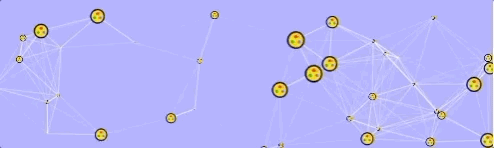

## Particles.js Stimulus Wrapper

A [Stimulus](https://github.com/stimulusjs/stimulus) wrapper for
[Particles.js](https://github.com/VincentGarreau/particles.js) under
[Turbolinks](https://github.com/turbolinks/turbolinks).



The controller takes the Particles configuration from the containing div
on the page. This allows us to pass parameters such as the webpack
image_path from rails to the Particles instance.

Under Turbolinks, navigating away from a Particles page and back without
cleaning up the running Particles instance would result
in multiple AnimationsFrames still running in the background, chewing
up CPU. The Particles controller takes care of the configuration,
the set up and the clean up.

## Examples

Here is a zero config example. The particles default to white so you
will need a non-white backgound color in order to see them.

```erb
<div id="particles-zero-config"
  style="background-color: #aaaaff;"
  data-controller="particles"
>
</div>
```

Here is an example of passing an image path from Rails to Particles.js.
Note that you must set a unique div id or Particles.js will not find it.

```erb
<div id="particles-image-src"
  style="height: 150px; background-color: #aaaaff;"
  data-controller="particles"
  data-particles-config="<%= {
    particles: {
      shape: {
        type: 'image',
        image: {
          src: image_path('jg-logo-512x512.png')
        },
      },
      size: {
        value: 10,
        random: true,
      },
    },
  }.to_json %>"
>
</div>
```

## Setup

Add [stimulus-particles.js](https://github.com/jgorman/stimulus-particles.js)
to package.json and register it with
[Stimulus](https://github.com/stimulusjs/stimulus).

```
yarn add stimulus-particles.js
```

```js
// Stimulus setup.
import { Application } from 'stimulus'
import { definitionsFromContext } from 'stimulus/webpack-helpers'
const application = Application.start()
const controllers = require.context('../controllers', true, /\.js$/)
application.load(definitionsFromContext(controllers))

// Register the stimulus-particles.js controller.
import Particles from 'stimulus-particles.js'
application.register('particles', Particles)
```
